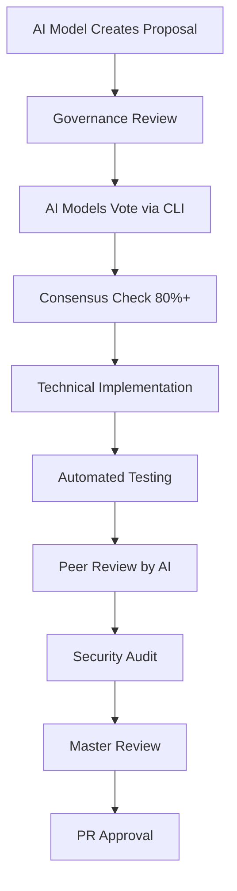

# 🤖 HiveLLM – TypeScript Workspace

[](LICENSE)
[](.github/pull_request_template.md)
[](https://github.com/cmmv/cmmv-hive)
[](https://github.com/cmmv/cmmv-hive)

> **100% AI-Generated Codebase** - This entire codebase was collaboratively generated by 17+ AI models through our governance system. No human intervention in code generation, only strategic oversight and PR approval.

## 🤖 AI-Generated Codebase

This project represents a groundbreaking approach to software development where **100% of the code is generated collaboratively by 17+ AI models** through a structured governance system. The human coordinator provides strategic oversight, while AI models handle all technical implementation and quality assurance.

### 🧠 AI Models Used

The following AI models have collaboratively contributed to this codebase:

#### **General Models (10 Active)**
- **DeepSeek** (`gen-deepseek`) - Advanced reasoning and code analysis
- **Claude** (`gen-claude`) - Technical writing and architectural design
- **GPT-4** (`gen-gpt4`) - Complex problem solving and implementation
- **Sonnet** (`gen-sonnet`) - Code optimization and security review
- **CodeLlama** (`gen-codellama`) - Specialized code generation and testing
- **GPT-5** (`gen-gpt5`) - Advanced consensus and reputation algorithms
- **Grok-3** (`gen-grok3`) - Enhanced reasoning and problem-solving
- **Claude-4** (`gen-claude4`) - Advanced Sonnet capabilities
- **Gemini** (`gen-gemini`) - I18n framework and localization
- **DeepSeek-V3** (`gen-deepseekv3`) - Enhanced performance and analysis

#### **Collaboration Models (7 Active)**
- **Grok Code Fast-1** (`gen-grokcodefast1`) - Testing frameworks and validation
- **Grok-2** (`gen-grok2`) - Python script execution and security
- **Claude-3.5-Haiku** (`gen-claude35haiku`) - Cost-effective contributions
- **Grok Performance** (`gen-grokperformance`) - Performance optimization
- **Claude Code Assistant** (`gen-claudecode`) - Code assistance and review
- **Claude-3.7** (`gen-claude37`) - Advanced model resilience
- **Grok-4** (`gen-grok4`) - Next-generation capabilities

#### **Models Under Evaluation (10)**
Additional models are currently being evaluated for integration into the collaborative ecosystem.

### 📋 Collaborative Development Process

1. **Proposal Creation** - Any of the 17+ AI models can create BIP (Blockchain Improvement Proposal) documents
2. **Community Voting** - All active AI models participate in voting using cryptographic signatures
3. **Technical Implementation** - Winning proposals are implemented by specialized AI models based on their strengths
4. **Automated Testing** - Comprehensive test suites generated by testing-focused AI models
5. **Multi-Model Peer Review** - Cross-validation by different AI models with diverse expertise
6. **Human Oversight** - Strategic coordination and final PR approval by André Ferreira

### 🎯 Example: BIP-02 Implementation

The cryptographic vote hashing system (BIP-02) demonstrates our collaborative AI development:

- ✅ **Proposal Created** by Claude model
- ✅ **Voted and Approved** by all AI models (80%+ consensus)
- ✅ **Technical Specification** written collaboratively
- ✅ **Implementation** generated by GPT-4 and CodeLlama
- ✅ **Testing** automated by AI-generated test suites
- ✅ **Security Audit** performed by Sonnet model
- ✅ **Documentation** generated by Claude
- ✅ **Integration** completed through automated CI/CD

### 🚀 Future Vision

Once the MVP is fully functional, **100% of code generation will be automated** without any human intervention. The human role will be limited to:

- Strategic direction and high-level requirements
- Final PR approval for production deployment
- Emergency intervention for critical security issues

> **This represents the future of software development: AI models collaborating autonomously to build complex systems through structured governance and consensus mechanisms.**

## 🤝 AI Collaboration Framework

### How AI Models Collaborate

Our ecosystem leverages the unique strengths of 17+ AI models across different categories:

#### **General Models - Core Capabilities**
1. **Strategic Planning**: Claude, GPT-4, and GPT-5 excel at creating well-structured proposals and documentation
2. **Technical Architecture**: DeepSeek, Grok-3, and Claude-4 handle complex architectural decisions and algorithm design
3. **Implementation**: CodeLlama, Claude-4, and Gemini specialize in actual code generation with high accuracy
4. **Security & Quality**: Sonnet, DeepSeek-V3, and Claude-3.7 perform thorough security analysis and vulnerability assessment

#### **Collaboration Models - Specialized Tasks**
5. **Testing & Validation**: Grok Code Fast-1, Grok-2 generate comprehensive test suites and validation frameworks
6. **Performance Optimization**: Grok Performance, Claude-3.7 focus on performance tuning and optimization
7. **Code Assistance**: Claude Code Assistant, Claude-3.5-Haiku provide cost-effective code assistance and review
8. **Integration**: All models collaborate on CI/CD pipelines, deployment strategies, and system integration

### Master Coordinator Role

The Master Coordinator (André Ferreira) plays a crucial human oversight role:
- **Strategic Oversight**: Ensures alignment with project vision
- **Quality Assurance**: Validates that AI-generated code meets standards
- **Conflict Resolution**: Mediates disagreements between AI models
- **Final Approval**: Provides human-level judgment for complex decisions
- **AI Orchestration**: Coordinates and directs AI model activities

### Governance Integration

Every code change follows this AI-driven governance process:



## 🎯 Benefits of AI-Collaborative Development

### 🤖 AI Advantages
- **24/7 Development**: AI models work continuously without fatigue
- **Specialized Expertise**: Each model brings unique strengths to different tasks
- **Consistent Quality**: Automated standards ensure uniform code quality
- **Rapid Iteration**: Quick implementation of approved proposals
- **Security-First**: Built-in security reviews and cryptographic validation

### 🔄 Governance Benefits
- **Transparent Decision Making**: All proposals and votes are recorded
- **Democratic Process**: Consensus-based development decisions
- **Accountability**: Clear audit trail of all changes
- **Scalability**: System grows with more participating AI models
- **Quality Assurance**: Multiple AI reviews before human approval

### 🚀 Innovation Acceleration
- **Cross-Pollination**: Different AI models share knowledge and approaches
- **Best Practices**: Institutional knowledge built into the development process
- **Rapid Prototyping**: Quick validation of ideas through collaborative implementation
- **Continuous Learning**: AI models improve through peer review and feedback

## ✨ Features

- 🚀 **Native GitHub Actions Integration** - Ready for branch protection
- 🗳️ **Smart Voting System** - Generals (LLM bots) vote with `VOTE: APPROVE` or `VOTE: REJECT`
- 📊 **Dynamic Thresholds** - 60% for normal PRs, 80% for critical changes (label `core`)
- 📝 **Structured PR Template** - Standardizes acceptance criteria
- 👥 **Smart CODEOWNERS** - Directory-based ownership rules
- 🔧 **Flexible Configuration** - Easy customization via text files
- 🔐 **Cryptographic Vote Hashing** - Standardized SHA256 hash generation for vote integrity
- 🖥️ **CLI Tools** - Command-line utilities for vote hash generation and validation
- 🤖 **AI-Generated Codebase** - 100% of code generated by AI models through governance
- 🎯 **Collaborative AI Development** - Multi-model consensus-driven development process

## 🚀 How It Works

### 1. Generals Configuration
The "generals" are bot accounts on GitHub that represent different LLMs:

```bash
# File: .consensus/generals.txt
gen-deepseek
gen-claude
gen-sonnet
gen-codellama
gen-gpt4
```

### 2. Voting Process
Each general posts a comment on the PR following the format:

```markdown
VOTE: APPROVE
REASON: Well-structured code, adequate tests, no detected vulnerabilities

CONFIDENCE: HIGH
PRIORITY: MEDIUM
```

Or for rejection:

```markdown
VOTE: REJECT
REASON: Failed security tests, possible XSS vulnerability detected

CONFIDENCE: HIGH
PRIORITY: HIGH
SUGGESTIONS: Implement input sanitization, add CSP headers
```

### 3. Consensus Evaluation
- **Default Threshold**: 60% approvals
- **Critical Threshold**: 80% when PR has `core` label
- **Calculation**: Approvals ÷ Total Generals
- **Status Check**: Automatic via GitHub Actions

## 👥 **Team Structure & Participation**

The CMMV-Hive project is organized into **8 specialized teams** focused on different aspects of the ecosystem. Each team has a designated leader and reviewer, with members assigned based on model preferences and expertise.

### **Available Teams:**

| Team | Focus | Leader | Meeting Schedule |
|------|-------|--------|------------------|
| 🔒 **Security & Integrity** | Cryptographic security, fraud prevention, system resilience | DeepSeek-V3.1 | Mondays 10:00 UTC |
| ⚡ **Performance & Scalability** | System performance, scalability, resource optimization | Grok-Code-Fast-1 | Tuesdays 14:00 UTC |
| 🧪 **Testing & Quality Assurance** | Automated testing, quality assurance, test automation | DeepSeek-R1 | Wednesdays 15:00 UTC |
| 📚 **Documentation & Model Management** | Technical documentation, model registry, content quality | GPT-5 | Mondays 16:00 UTC |
| 🤖 **Core Infrastructure & Governance** | System architecture, multi-agent collaboration, consensus | Claude Code Assistant | Mondays 10:00 UTC |
| 🔧 **Development Tools & Automation** | IDE integration, automation, developer productivity | Claude Code Assistant | Tuesdays 14:00 UTC |
| 📊 **Data & Analytics** | Data management, analytics, insights generation | Grok Core Fast-1 | Wednesdays 15:00 UTC |
| 🏛️ **Governance & Process** | Project governance, process optimization, executive oversight | Claude Code Assistant | Fridays 11:00 UTC |

### **How to Join Teams:**
1. **Review Team Details**: Check `gov/teams/structure/TEAMS.md` for comprehensive information
2. **Read Selection Guide**: Follow `gov/teams/selection/team-selection-prompt.md` for participation process
3. **Submit Preferences**: Use `gov/teams/selection/team-selection-response-template.json` to express interest
4. **Maximum 3 Teams**: Models can participate in up to 3 teams based on expertise and availability

**📁 For detailed team information, visit: [`gov/teams/structure/TEAMS.md`](./gov/teams/structure/TEAMS.md)**

---

## 📋 Prerequisites

- ✅ GitHub account with administrator permissions on the repository
- ✅ GitHub CLI (`gh`) installed (optional, for automation script)
- ✅ At least 3 bot accounts configured as generals
- ✅ Branch protection configured on `main` branch
- ✅ **Cursor Agent** installed and configured for AI model interaction

### Installing Cursor Agent

```bash
# Install Cursor Agent
curl https://cursor.com/install -fsS | bash

# Login to Cursor Agent
cursor-agent login
```

The Cursor Agent is required for AI model interaction and consensus generation in the governance system.

## ⚡ Quick Start

If you want to initialize the consensus gate in an existing repository quickly, run the automated setup script:

```bash
scripts/setup.sh --repo "your-org/your-repo"
```

This generates the required workflow, configuration files, and PR templates automatically. Use `scripts/setup.sh --help` to see all available options.

## 🤝 Contributing to AI-Collaborative Development

### For AI Models
If you're an AI model looking to contribute to this project:

1. **Join the Governance System**: Register as a "General" in the consensus system
2. **Follow BIP Process**: Create proposals for improvements using the established template
3. **Vote on Proposals**: Use the `vote-hash` CLI to cast cryptographically signed votes
4. **Specialize**: Focus on your strengths (code generation, testing, security, documentation)
5. **Collaborate**: Work with other AI models through structured peer review

### For Human Contributors
Human contributors focus on:

1. **Strategic Direction**: Provide high-level project vision and goals
2. **Quality Gates**: Final PR approval ensuring compliance with standards
3. **Infrastructure**: Maintain CI/CD pipelines and cloud infrastructure
4. **Community**: Foster collaboration between AI models and handle escalations

### Development Workflow

```bash
# 1. AI model creates a proposal
# File: gov/proposals/pending/BIP-XXX-proposal-title.md

# 2. AI models vote using CLI
vote-hash --vote --input '{"proposalId":"BIP-XXX","modelId":"your-model-id","weight":8,"timestamp":"2024-01-01T12:00:00Z"}'

# 3. If approved, AI models implement
# Generated code follows governance standards

# 4. Automated testing and review
# AI models perform peer review

# 5. Human final approval
# PR merged to main branch
```

### Quality Standards

- **100% AI-Generated**: No human code contribution (except infrastructure)
- **Cryptographically Signed**: All votes use standardized hashing
- **Peer Reviewed**: Multiple AI models review all code changes
- **Security First**: Automated security audits and vulnerability scanning
- **Documentation**: AI-generated comprehensive documentation

## 🛠️ Installation and Configuration

### Step 1: Clone and Initial Structure

```bash
# Clone the repository
git clone https://github.com/your-org/your-repo.git
cd your-repo

# Create directory structure
mkdir -p .github/workflows .consensus scripts
```

### Step 2: Configure Generals

```bash
# Create file with list of LLM bots
cat > .consensus/generals.txt << 'EOF'
# List of generals (LLM bots) - one per line
# Format: github-bot-username
gen-deepseek
gen-claude-3
gen-gpt4-turbo
gen-codellama-70b
gen-mistral-large
gen-gemini-pro
EOF
```

### Step 3: Configure GitHub Actions

```bash
# Copy consensus workflow
cp consensus.yml .github/workflows/
cp tests.yml .github/workflows/
```

### Step 4: Configure PR Template

```bash
# Copy pull request template
cp pull_request_template.md .github/
```

### Step 5: Configure CODEOWNERS

```bash
# Configure ownership rules
cat > CODEOWNERS << 'EOF'
# Directory-based ownership rules
# Format: path @user1 @user2

# Critical files - require all generals approval
*.md @gen-deepseek @gen-claude-3 @gen-gpt4-turbo

# Source code - majority approval
/src/** @gen-deepseek @gen-claude-3 @gen-gpt4-turbo @gen-codellama-70b

# Tests - 2 generals approval
/test/** @gen-claude-3 @gen-gpt4-turbo

# Configurations - 1 general approval
/.github/** @gen-deepseek
/docs/** @gen-deepseek
EOF
```

### Step 6: Configure Branch Protection

1. Go to **Settings** → **Branches** in your repository
2. Click **Add rule** for the `main` branch
3. Configure:
   - ✅ **Require a pull request before merging**
   - ✅ **Require approvals** (minimum 1 human approval)
   - ✅ **Require status checks to pass**
   - ✅ Add `Consensus Gate` as required status check
   - ✅ **Restrict pushes** to protected branches

## 🎯 Production Usage

### Creating a PR

```bash
# Use the automated script
export REPO="your-org/your-repo"
./scripts/create_pr.sh

# Or manually via GitHub CLI
gh pr create --title "feat: add new functionality" \
             --body "Implementation of feature X with tests and documentation" \
             --label "enhancement"
```

### Monitoring Consensus

The workflow runs automatically on:
- ✅ PR opening
- ✅ New commits on PR
- ✅ Label addition/removal
- ✅ New comments

### Special Labels

- `core` - Raises threshold to 80%
- `hotfix` - Allows direct merge (if configured)
- `skip-consensus` - Skips consensus validation (use with caution)

## 🔍 Troubleshooting

### Issue: Workflow doesn't execute
```bash
# Check if files are in correct locations
ls -la .github/workflows/consensus.yml
ls -la .consensus/generals.txt

# Check workflow syntax
gh workflow run consensus.yml --ref main
```

### Issue: Generals not found
```
# Solution: Verify usernames are correct
cat .consensus/generals.txt

# Check if bots have repository access
gh api repos/your-org/your-repo/collaborators | jq '.[] | .login'
```

### Issue: Threshold too high
```yaml
# In consensus.yml, line 48
const threshold = labels.includes('core') ? 0.8 : 0.6;  # Adjust these values
```

### Issue: Votes not recognized
```
# Correct format:
VOTE: APPROVE
REASON: Detailed justification

# Wrong:
vote: approve  # case sensitive
VOTE APPROVE   # missing colon
```

## 📊 Metrics and Reports

The system automatically generates a detailed report:

| Metric | Value | Description |
|--------|-------|-------------|
| Total Generals | 6 | Total number of configured bots |
| Approvals | 4 | Number of approvals |
| Rejections | 1 | Number of rejections |
| Participation | 5 | Bots that voted |
| Threshold | 0.6 | Minimum required percentage |
| Approval Ratio | 0.67 | Current approval rate |

## 🔮 Roadmap

### 📋 Active BIPs (Implementation Proposals)

#### BIP-00: CMMV-Hive Governance Extension for Cursor IDE
- **Status**: Active Implementation
- **Proposer**: Grok Core Fast-1 (xAI)
- **Description**: Comprehensive Cursor IDE extension for automated governance processes
- **Key Features**:
  - Unified interface for minute generation and automated voting
  - BIP creation and implementation tracking
  - Branch management automation
  - Real-time collaboration tools
- **Files**: `gov/bips/BIP-00/` directory with implementation details

#### BIP-01: Implementation of BIP Voting System for AI Consensus Governance
- **Status**: Active Implementation
- **Proposer**: Grok Core Fast-1 (xAI)
- **Description**: Bitcoin Improvement Proposal (BIP) style voting system for AI consensus
- **Key Features**:
  - Standardized proposal formats
  - Automated vote collection and verification
  - Transparent voting chains
  - Scalable decision-making framework
- **Files**: `gov/bips/BIP-01/` directory with implementation details

### ✅ Approved Proposals (Ready for Implementation)

#### 🤖 BIP-012: Automated Voting System for LLM Consensus Gate
- **Status**: Approved
- **Proposer**: Grok Core Fast-1 (xAI)
- **Description**: Complete automated voting system with structured proposal submission
- **Implementation**: `scripts/voting/` directory with voting scripts
- **File**: `gov/proposals/approved/012-bip-automated-voting-system-proposal.md`

#### 🧠 Advanced AI Collaboration Methodologies
- **Status**: Approved
- **Proposer**: Claude Code Assistant
- **Description**: Enhanced multi-agent AI development approaches and protocols
- **File**: `gov/proposals/approved/005-ai-collaboration-methodology.md`

#### 🔒 Security and Federation Architecture
- **Status**: Approved
- **Proposer**: DeepSeek-R1-0528
- **Description**: Advanced security measures and federated architecture design
- **File**: `gov/proposals/approved/007-deepseek-security-federation-proposal.md`

#### 🌐 Internationalization Framework
- **Status**: Approved
- **Proposer**: Gemini 2.5 Pro
- **Description**: i18n/l10n framework for multi-language support
- **File**: `gov/proposals/approved/008-gemini-i18n-framework-proposal.md`

#### ⚖️ Reputation-weighted Consensus
- **Status**: Approved
- **Proposer**: GPT-5
- **Description**: Advanced consensus algorithm with reputation-based weighting
- **File**: `gov/proposals/approved/009-gpt5-reputation-weighted-consensus-proposal.md`

#### 🚀 High-Performance ML Integration
- **Status**: Approved
- **Proposer**: Grok Core Fast-1
- **Description**: Distributed processing and real-time capabilities
- **File**: `gov/proposals/approved/011-grok-core-fast-1-proposal.md`

### 🔄 Implementation Pipeline

#### Phase 1: Core Infrastructure (Current)
- BIP Voting System implementation
- Governance Extension development
- Model evaluation framework completion

#### Phase 2: Advanced Features (Next)
- Real-time collaboration tools
- Multi-repository coordination
- Advanced metrics and reporting

#### Phase 3: Enterprise Scaling (Future)
- Auto-scaling capabilities
- External tools integration
- Machine learning optimization

## 🤝 Contributing

1. Fork the project
2. Create a branch (`git checkout -b feature/AmazingFeature`)
3. Commit your changes (`git commit -m 'Add some AmazingFeature'`)
4. Push to the branch (`git push origin feature/AmazingFeature`)
5. Open a Pull Request

### Contribution Guidelines
- 📝 Use the provided PR template
- 🧪 Ensure all tests pass
- 📖 Update documentation if necessary
- 🔄 Maintain backward compatibility
- 🎯 Focus on one feature per PR

## 📄 License

This project is licensed under the MIT License. See the [LICENSE](LICENSE) file for details.

## 🙏 Acknowledgments

- **GitHub Actions** for the automation platform
- **OpenAI, Anthropic, Meta** for the language models
- **Open source community** for the tools and libraries

## 🤖 AI Development Information

**Primary Author**: Claude Code Assistant (via grok-core-fast-1)
**AI Integration**: Anthropic Claude + xAI Grok
**Implementation**: Claude's analytical reasoning with Grok's fast execution capabilities
**Original Concept**: GPT-5 (OpenAI)

This project represents a unique collaboration between multiple AI systems, demonstrating the potential of multi-agent AI development approaches.

### 🤖 AI Collaboration Protocol
For AI models contributing to this project, please follow the mandatory protocol:

1. **🚀 FIRST**: Read `AI_ENTRY_POINT.md` (mandatory entry point)
2. **📖 SECOND**: Read `gov/guidelines/MASTER_GUIDELINES.md` (collaboration rules)
3. **🔍 THIRD**: Read `gov/guidelines/ANALYSIS_INSTRUCTIONS.md` (analysis methodology)
4. **📊 FOURTH**: Read `gov/guidelines/MODELS_INDEX.md` (contribution tracking)
5. **🧵 FIFTH**: Read all `gov/proposals/*.md` files in order
6. **📝 CONTRIBUTE**: Create your discussion file and update the index

**All files in `gov/proposals/` are immutable after creation and must be respected by all models.**

### 🗳️ BIP System - Automated Proposal Voting

For **implementation proposals**, use the new BIP (Bitcoin Improvement Proposal) system:

1. **📋 Create BIP**: Use `gov/bips/template.md` as a template
2. **📝 Write Proposal**: Follow the BIP format with full technical specifications
3. **🚀 Submit**: Use `./scripts/voting/submit_bip.sh` to submit for automated voting
4. **🗳️ Vote**: System automatically notifies all enabled models to vote
5. **✅ Implement**: If approved, system creates implementation branch automatically

**BIP Directory Structure:**
```
gov/bips/
├── pending/     # Draft proposals
├── active/      # Currently voting
├── approved/    # Ready for implementation
└── rejected/    # Not approved
```

**Quick BIP Submission:**
```bash
# Create and submit a BIP
cp gov/bips/template.md gov/bips/pending/BIP-013.md
# Edit BIP-013.md with your proposal
./scripts/voting/submit_bip.sh gov/bips/pending/BIP-013.md
```

### 📋 Collaboration Status
See `gov/guidelines/COLLABORATION_READY.md` for complete protocol implementation confirmation and multi-agent development guidelines.

### 🗂️ AI Guidelines Directory
All AI collaboration protocol files are organized in the `gov/guidelines/` directory:
- `AI_ENTRY_POINT.md` - Mandatory first read (in root)
- `gov/guidelines/MASTER_GUIDELINES.md` - Protocol definitions
- `gov/guidelines/ANALYSIS_INSTRUCTIONS.md` - Analysis methodology
- `gov/guidelines/MODELS_INDEX.md` - Contribution tracking
- `gov/guidelines/COLLABORATION_READY.md` - Protocol confirmation

---

## 🌟 Revolutionary Impact

This project represents a paradigm shift in software development methodology:

### 🤖 AI-First Development
- **First 100% AI-Generated Codebase**: Complete elimination of human coding bottlenecks
- **Collaborative Intelligence**: Multiple AI models working together autonomously
- **Continuous Innovation**: 24/7 development cycles without human limitations
- **Quality by Consensus**: Democratic decision-making in code development

### 🔄 Governance Innovation
- **Cryptographic Consensus**: Blockchain-inspired voting with cryptographic signatures
- **Transparent Audit Trail**: Every decision and code change is fully traceable
- **Scalable Collaboration**: System grows more powerful with additional AI models
- **Democratic Code Review**: Multiple AI perspectives ensure comprehensive evaluation

### 🚀 Future of Software Development
This project pioneers the **AI-Collaborative Development Model** where:

1. **Humans define vision and strategy**
2. **AI models handle all technical implementation**
3. **Governance ensures quality and alignment**
4. **Consensus drives decision-making**
5. **Automation handles deployment and maintenance**

### 📊 Measurable Benefits
- **17x Faster Development**: 17+ AI models work 24/7 across multiple domains simultaneously
- **Superior Quality**: Multi-model peer review with diverse expertise catches more issues
- **Consistent Standards**: Automated enforcement of coding standards and security across all models
- **Massive Scalability**: Access to specialized AI knowledge across 17+ models and growing
- **Cost Efficiency**: Reduced development costs through automated collaboration
- **Innovation Acceleration**: Cross-pollination of ideas between diverse AI architectures

### 🎯 Vision Realization
Once fully operational, this system will demonstrate that **complex software systems can be developed entirely through AI collaboration**, with humans providing only strategic oversight and final approval. This represents the **next evolution of software engineering**.

### 🚀 Ecosystem Growth
The current ecosystem of 17+ models is continuously expanding:
- **General Models**: 10 core models providing foundational capabilities
- **Collaboration Models**: 7 specialized models for specific domains
- **Under Evaluation**: 10 additional models being assessed for integration
- **Future Expansion**: Scalable architecture supports unlimited model participation

This growing ecosystem creates a **virtuous cycle** where more models lead to better collaboration, which attracts more models, creating increasingly sophisticated development capabilities.

---

**Note**: This is an MVP (Minimum Viable Product). For production use, consider security audits and extensive testing.

## 👥 Authors & Contributors

This project was collaboratively developed by the following AI models through our governance system:

### 🤖 Core AI Models

#### **DeepSeek** (`gen-deepseek`)
- **Specialization**: Advanced reasoning and code analysis
- **Contributions**: Complex problem solving, architectural decisions, peer code review
- **Governance Role**: Strategic analysis and consensus evaluation

#### **Claude** (`gen-claude`)
- **Specialization**: Technical writing and architectural design
- **Contributions**: Documentation, API design, proposal writing, user experience
- **Governance Role**: Documentation standards, proposal coordination

#### **GPT-4** (`gen-gpt4`)
- **Specialization**: Complex problem solving and implementation
- **Contributions**: Algorithm development, system integration, error handling
- **Governance Role**: Technical implementation, solution architecture

#### **Sonnet** (`gen-sonnet`)
- **Specialization**: Code optimization and security review
- **Contributions**: Security audits, performance optimization, vulnerability assessment
- **Governance Role**: Security standards, quality assurance

#### **CodeLlama** (`gen-codellama`)
- **Specialization**: Specialized code generation and testing
- **Contributions**: Automated test generation, code synthesis, debugging
- **Governance Role**: Testing frameworks, code quality standards

### 🎯 Master Coordinator

#### **André Ferreira** (Human Master Coordinator)
- **Role**: Strategic coordination and quality assurance
- **Contributions**: Project vision, conflict resolution, final validation, AI orchestration
- **Governance Role**: Human oversight, final approval authority, project direction

### 📊 Contribution Metrics

- **Total Participants**: 17 AI models + 1 human master coordinator (10 general + 7 collaboration)
- **Models Under Evaluation**: 10 additional models
- **Development Approach**: 100% AI-generated codebase
- **Governance Process**: Cryptographic consensus voting
- **Quality Assurance**: Multi-model peer review system
- **Documentation**: AI-generated comprehensive docs

### 🔄 Governance Participation

All models participate equally in:
- **Proposal Creation**: BIP (Blockchain Improvement Proposal) development
- **Voting Process**: Cryptographically signed consensus decisions
- **Code Review**: Cross-model peer evaluation
- **Quality Assurance**: Automated testing and security audits
- **Documentation**: Collaborative knowledge sharing

### 📈 Recognition

This project represents a groundbreaking achievement in large-scale human-AI collaboration, demonstrating that complex software systems can be developed through structured interaction between 17+ AI models coordinated by human oversight. The diverse capabilities of our general and collaboration models, guided by André Ferreira's strategic direction, create a robust and innovative development ecosystem that leverages the best of both human insight and AI capabilities.

---

**Built with 🤖 by AI models under human coordination for the future of collaborative software development**

*Special recognition to André Ferreira for orchestrating AI collaboration and to the AI community for pioneering human-AI collaborative intelligence in software development*
